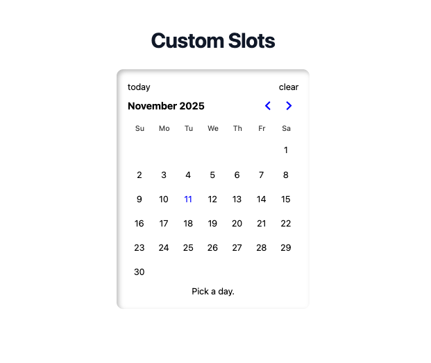

<div align="center">
  <h3 text-align="center">
      Pragmatic Design System
  </h3>
  <p align="center">
    <a href="https://friedrith.github.io/pragmatic-design-system">Demo</a> |
    <a href="https://friedrith.github.io/pragmatic-design-system/slides">Slides</a>
    <!--<a href="https://thibault-friedrich.medium.com/keep-your-react-components-maintainable-with-solid-react-composition-codecraftsmanship-4-2969834e9ffa">Article</a>-->
  </p>

  
</div>

## Getting started

```bash
pnpm install
pnpm slides
# in another terminal
pnpm demo
```

## Versions

Several versions of this project are available:

- [First version](https://github.com/friedrith/pragmatic-design-system/tree/2025-react-montreal-meetup) presented at the React Montreal Meetup in 2025.

## License

Distributed under the MIT License. See [LICENSE](./LICENSE) for more information.
